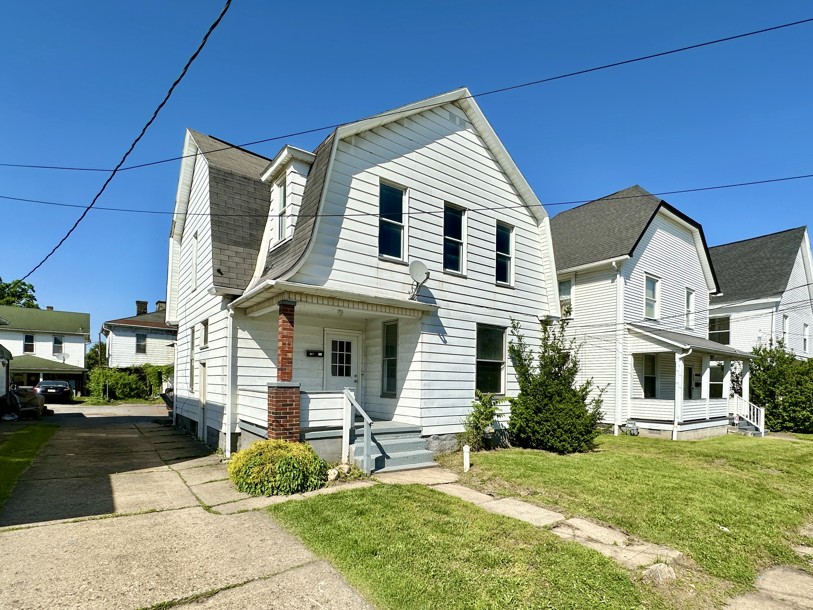

<html lang="en">
<head>
  <meta charset="utf-8">
  <meta name="viewport" content="width=device-width, initial-scale=1">
  <title>New Castle PA Rentals</title>
  <meta name="description" content="Pet-friendly homes for rent in New Castle, Pennsylvania. Call or text 516-313-7299.">
  
</head>
<body>
  <header class="top">
    
New Castle PA Rentals

    <a class="button" href="tel:5163137299">Call or Text 516-313-7299</a>
  </header>

  <main>
    <section class="hero">
      

        
Homes for rent in New Castle, PA

        <h1>Simple rentals. Clear prices. Real help.</h1>
        
We have pet-friendly homes for rent in New Castle. There are no extra pet fees. Call or text and a real person will answer.

        

          <a class="button" href="#rentals">See Rentals</a>
          <a class="button" href="sms:5163137299">Text Us Now</a>
        

      

    </section>

    <section class="info-strip" aria-label="Rental benefits">
      

        <strong>Pets are welcome</strong>
        No extra pet fees.
      

      

        <strong>Fast answers</strong>
        Call or text a real person.
      

      

        <strong>Easy to tour</strong>
        Ask about showings and move-in dates.
      

    </section>

    <section id="rentals" class="section">
      

        
Available now

        <h2>Homes for rent</h2>
        
Click “View on Zillow” to see more photos and details. Call or text for the fastest answer.

      

      

        <article class="listing">
          
          

            <h3>413 Bartram Ave New Castle, PA 16101</h3>
            
$1,500 per month

            <ul class="tags">
              <li>5 bedrooms</li>
              <li>1 bathroom</li>
              <li>Central air</li>
              <li>Pets OK</li>
            </ul>
            
Large 5-bedroom home with space to spread out. Pets are welcome with no extra pet fee.

            <a class="button" href="https://www.zillow.com/homedetails/413-Bartram-Ave-New-Castle-PA-16101/93630034_zpid/" target="_blank" rel="noopener">View on Zillow</a>
          

        </article>

        <article class="listing">
          
          

            <h3>613 Countyline St, Unit 1 New Castle, PA 16101</h3>
            
$900 per month

            <ul class="tags">
              <li>Unit 1</li>
              <li>Good price</li>
              <li>Pets OK</li>
              <li>No pet fee</li>
            </ul>
            
A simple rental at a lower monthly price. Call or text to ask about showings and move-in timing.

            <a class="button" href="https://www.zillow.com/homedetails/613-Countyline-St-UNIT-1-New-Castle-PA-16101/452273130_zpid/" target="_blank" rel="noopener">View on Zillow</a>
          

        </article>

        <article class="listing">
          
          

            <h3>29 W Miller St New Castle, PA 16102</h3>
            
$1,100 per month

            <ul class="tags">
              <li>2 bedrooms</li>
              <li>1 bathroom</li>
              <li>Massive garage</li>
              <li>Available now</li>
            </ul>
            
Available right away. This home has a huge garage and useful outdoor space.

            <a class="button" href="https://www.zillow.com/b/29-w-miller-st-new-castle-pa-9PRpDq/" target="_blank" rel="noopener">View on Zillow</a>
          

        </article>
      

    </section>

    <section class="section contact">
      

        
Contact us

        <h2>Want to see a home?</h2>
        
Call, text, or email. A real person will answer.

        

          <a href="tel:5163137299">Call: 516-313-7299</a>
          <a href="sms:5163137299">Text: 516-313-7299</a>
          <a href="mailto:newcastleparentals@gmail.com">Email: newcastleparentals@gmail.com</a>
        

      

    </section>
  </main>

  <footer>
    New Castle PA Rentals. Pet-friendly homes with no extra pet fees.
  </footer>
</body>
</html>
